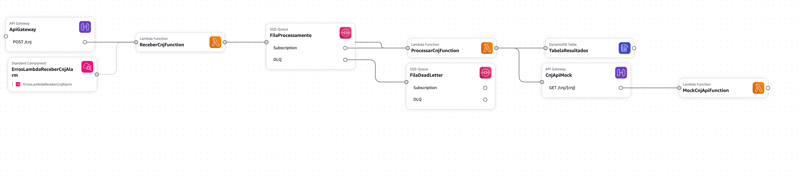

# Processador CNJ - Arquitetura Serverless AWS

Sistema serverless para processamento assíncrono de números CNJ (Conselho Nacional de Justiça), construído com AWS SAM e arquitetura orientada a eventos.

## Funcionalidade

Este sistema recebe números de processos judiciais (CNJ), valida-os, e realiza o processamento assíncrono, consultando informações adicionais via API externa (simulada através de um mock), e armazenando os resultados no DynamoDB.

## Arquitetura


(feita no Cloud Formation)

A solução utiliza os seguintes serviços AWS:

- **API Gateway**: Endpoint HTTPS para receber requisições com números CNJ
- **Lambda**: Funções serverless para processamento e validação
- **SQS**: Filas para processamento assíncrono e garantia de entrega
- **DynamoDB**: Armazenamento dos resultados de processamento
- **CloudWatch**: Monitoramento, logs e alarmes

## Requisitos

- AWS CLI instalado e configurado
- SAM CLI instalado
- Node.js 18.x ou superior
- Uma conta AWS com permissões para criar recursos

## Como executar

### 1. Clone o repositório

```bash
git clone <url-do-repositorio>
cd cnj-processor
```

### 2. Instale as dependências

```bash
cd .\src\
npm install
cd ..
```

### 3. Construa e implante a aplicação

```bash
sam build
sam deploy --guided
```

Na primeira execução, use a opção `--guided` para configurar os parâmetros de implantação. Nas próximas vezes, você pode omitir essa opção.

### 4. Anote os outputs da implantação

Após a implantação bem-sucedida, o SAM CLI exibirá informações importantes:

- **ApiEndpoint**: URL da API para enviar solicitações
- **ApiKey**: Instruções para obter a chave de API necessária para autenticação
- **MockApiUrl**: URL da API mock para simulação da API externa

### 5. Obtenha sua API Key

Execute o comando exibido nos outputs para obter sua API Key:

```bash
aws apigateway get-api-keys --include-values --query 'items[?name==`cnj-api-key`].value' --output text
```

## Como testar a aplicação

### 1. Envie um número CNJ para processamento

```bash
curl -X POST https://<api-id>.execute-api.<região>.amazonaws.com/dev/cnj \
  -H "Content-Type: application/json" \
  -H "x-api-key: <sua-api-key>" \
  -d '{"cnj": "1234567-12.2023.1.01.0001"}'
```

### 2. Verifique a resposta

A API retornará uma resposta imediata confirmando que o CNJ foi recebido para processamento:

```json
{
	"mensagem": "CNJ recebido para processamento",
	"cnj": "1234567-12.2023.1.01.0001",
	"id": "req-123456789"
}
```

### 3. Verifique o resultado no DynamoDB

O processamento é assíncrono. Para verificar o resultado:

```bash
aws dynamodb get-item \
  --table-name cnj-resultados-dev \
  --key '{"cnj": {"S": "1234567-12.2023.1.01.0001"}}'
```

## Estrutura do projeto

```
cnj-processor/
├── .aws-sam/                 # Diretório de build do SAM (gerado automaticamente)
├── src/                      # Código fonte da aplicação
│   ├── application/          # Lógica de aplicação/casos de uso
│   ├── domain/               # Regras e entidades de domínio
│   │   └── cnj.js            # Entidade CNJ com validações
│   ├── infrastructure/       # Adaptadores para serviços externos
│   │   ├── api/              # Clientes de API
│   │   │   └── cnjService.js # Serviço para consulta de CNJ
│   │   └── repositories/     # Repositórios de dados
│   │       └── resultadoRepository.js # Repositório para DynamoDB
│   ├── interfaces/           # Adaptadores de entrada
│   │   └── lambdas/          # Handlers das funções Lambda
│   │       ├── receberCnj.js # Lambda que recebe CNJ via API
│   │       └── processarCnj.js # Lambda que processa CNJ da fila
│   └── mocks/                # Mocks para desenvolvimento/testes
│       └── cnj-api/          # Mock da API externa
│           └── index.js      # Handler do mock
├── template.yaml            # Template SAM/CloudFormation
└── package.json             # Definição de dependências
```

## Comportamento do Mock

A API mock retorna diferentes resultados com base no último dígito do número CNJ:

- **0, 4, 8**: Processos em andamento (TJSP)
- **1, 5, 9**: Processos arquivados (TJRJ)
- **2, 6**: Processos suspensos (TJMG)
- **3, 7**: Processos julgados (TRF1)

Você pode testar diferentes cenários enviando CNJs com diferentes dígitos finais.

## Acessando logs e monitoramento

Para visualizar os logs das funções Lambda:

```bash
# Logs da função de recebimento
sam logs -n ReceberCnjFunction --stack-name cnj-processor

# Logs da função de processamento
sam logs -n ProcessarCnjFunction --stack-name cnj-processor

# Logs da função mock
sam logs -n MockCnjApiFunction --stack-name cnj-processor
```

Para monitoramento mais detalhado, acesse o console AWS CloudWatch.

## Limpeza

Para remover todos os recursos criados:

```bash
sam delete
```

## Arquitetura técnica

A aplicação segue princípios de arquitetura limpa (clean architecture) com divisão clara de responsabilidades:

- **Domain**: Contém as regras de negócio centrais e entidades
- **Application**: Orquestra o fluxo entre domínio e infraestrutura
- **Infrastructure**: Implementa a comunicação com serviços externos
- **Interfaces**: Adaptadores para entrada de dados

Essa abordagem facilita a manutenção, testes e evolução do sistema.
